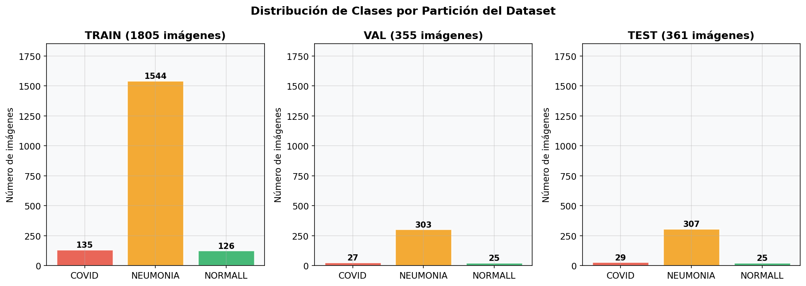
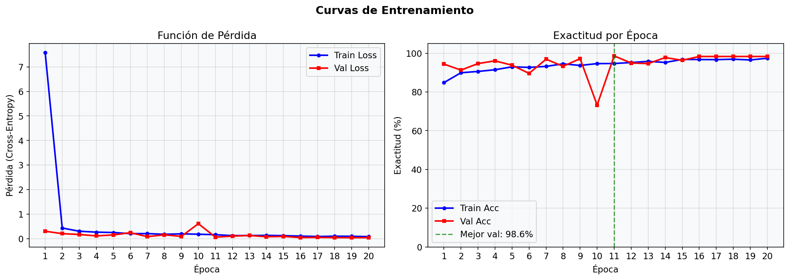
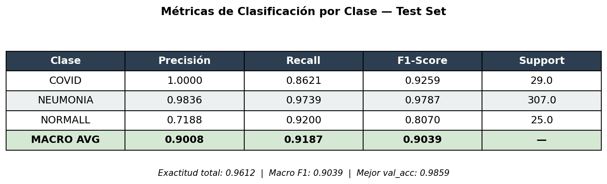
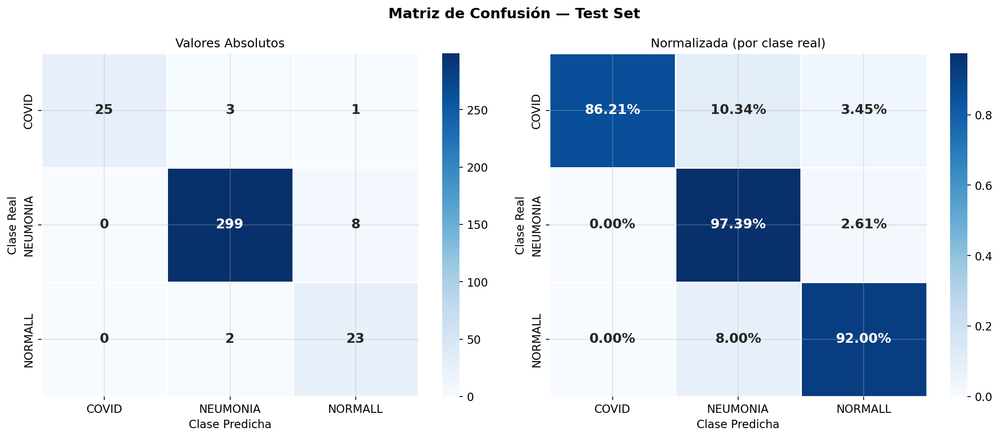
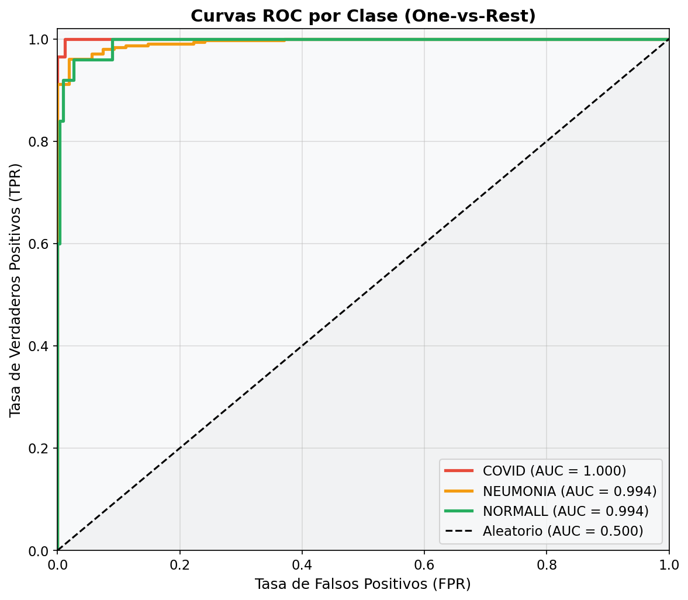
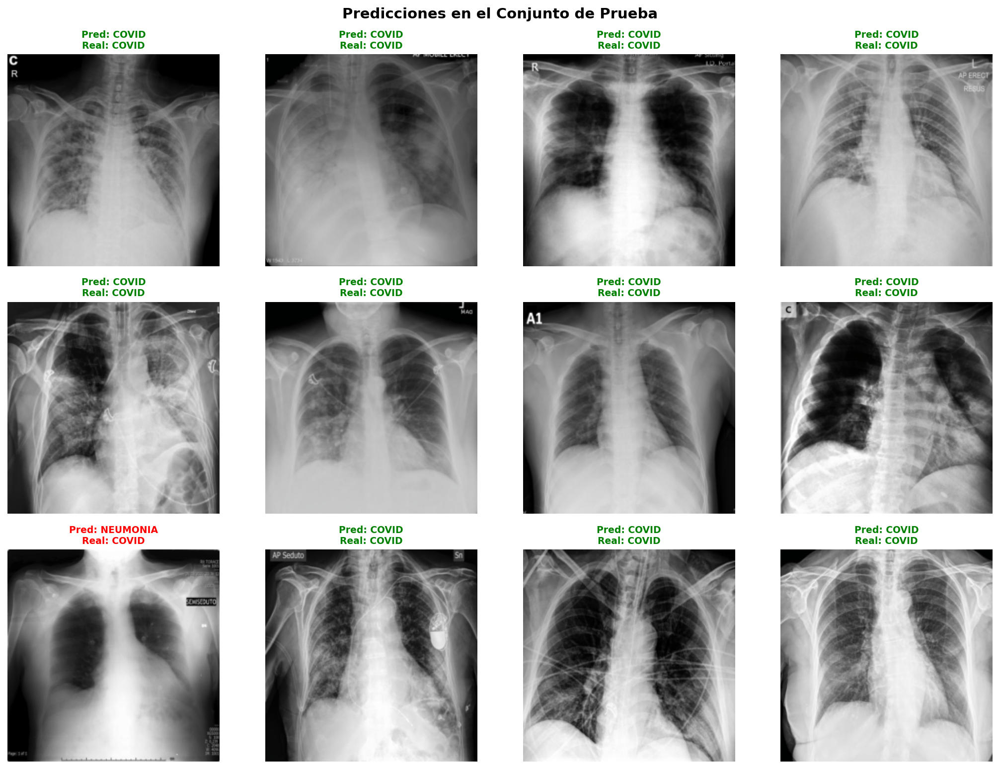

# Clasificación Automatizada de Enfermedades Respiratorias Mediante Redes Neuronales Convolucionales: COVID-19, Neumonía y Condición Normal

**Andres Bardales** · **[Nombre compañero/a de bina]**  
*Maestría en Inteligencia Artificial — Aprendizaje Supervisado*  
*Universidad [Nombre] — Segundo Cuatrimestre, 2026*

---

## Resumen

Se presenta el diseño, implementación y evaluación de una Red Neuronal Convolucional (CNN) para la clasificación automática de imágenes de rayos X de tórax en tres categorías clínicas: COVID-19, Neumonía y condición Normal. El conjunto de datos comprende **2,521 imágenes** distribuidas en particiones de entrenamiento (71.6%), validación (14.1%) y prueba (14.3%), con un marcado desbalance de clases dominado por la clase Neumonía. La arquitectura propuesta —denominada *RespiratoryCNN*— consta de tres bloques convolucionales con normalización por lotes, seguidos de capas totalmente conectadas con regularización Dropout (p=0.3). El entrenamiento se realizó sobre infraestructura cloud de Amazon Web Services (instancia c5.2xlarge) con PyTorch 2.11, completando 20 épocas en 33.3 minutos. Los resultados sobre el conjunto de prueba muestran una **exactitud del 96.12%** y un **F1-Score macro de 90.39%**. Destaca que el modelo alcanza precisión perfecta (1.000) para la clase COVID-19, lo que es clínicamente relevante al eliminar falsos positivos de esta condición. Se desarrolló además una interfaz de inferencia basada en Gradio, disponible vía web, que permite clasificar nuevas radiografías en tiempo real. El código, los pesos del modelo y la infraestructura como código (Terraform) están disponibles en el repositorio del proyecto.

**Palabras clave:** Redes Neuronales Convolucionales, COVID-19, Rayos X de Tórax, Clasificación de Imágenes, PyTorch, AWS, Aprendizaje Profundo.

---

## 1. Introducción

La pandemia de COVID-19 evidenció la necesidad crítica de herramientas de diagnóstico rápidas y escalables. La radiografía de tórax (Rx) es uno de los estudios de imagen más utilizados a nivel mundial para detectar patologías pulmonares; sin embargo, su interpretación manual por radiólogos es un proceso costoso, lento y sujeto a variabilidad inter-observador, particularmente en entornos de alta demanda como los registrados durante la pandemia [1].

Las técnicas de Aprendizaje Profundo (*Deep Learning*), específicamente las Redes Neuronales Convolucionales (CNN), han demostrado capacidad diagnóstica comparable a la de especialistas en múltiples dominios de imagen médica [2]. Su capacidad para aprender representaciones jerárquicas directamente de los píxeles, sin necesidad de ingeniería manual de características, las convierte en candidatas naturales para la automatización del diagnóstico radiológico.

El presente trabajo aborda el problema de clasificación multiclase de imágenes de rayos X de tórax en tres condiciones: (i) COVID-19, (ii) Neumonía bacteriana o viral, y (iii) condición Normal. La distinción correcta entre estas patologías es clínicamente crítica: un falso positivo de COVID-19 implica aislamiento innecesario del paciente, mientras que un falso negativo puede propagar la enfermedad; por su parte, la confusión entre Neumonía y condición Normal retarda el inicio de tratamiento antibiótico o antiviral.

La contribución principal de este trabajo es doble: (1) el diseño y evaluación de una CNN compacta entrenada desde cero con datos de escala moderada, y (2) el desarrollo de un sistema de extremo a extremo (*end-to-end*) completamente reproducible en la nube —desde la ingestión del dataset hasta la inferencia interactiva—, orquestado mediante Apache Airflow, almacenado en Amazon S3 y desplegado sobre instancias EC2.

---

## 2. Trabajo Relacionado

El uso de CNN para el análisis de imágenes de tórax tiene una historia reciente pero prolífica.

**CheXNet** [3] fue uno de los primeros trabajos en demostrar que una DenseNet-121 entrenada con más de 100,000 radiografías del dataset ChestX-ray14 podía detectar neumonía con rendimiento superhumano en métricas de AUC. Este trabajo estableció el paradigma del *transfer learning* como estrategia dominante en imagen médica.

Con la pandemia de COVID-19, surgieron numerosas propuestas de diagnóstico automático mediante Rx. **COVID-Net** [4] diseñó una arquitectura específica para la detección de COVID-19, reportando sensibilidades superiores al 91%. Sin embargo, la revisión crítica de Maguolo & Nanni [5] señaló que muchos de estos sistemas sufrían de sesgos de dataset (artefactos de adquisición, diferencias en resolución) que inflaban artificialmente las métricas reportadas.

En cuanto a la problemática del desbalance de clases —presente en nuestro dataset—, técnicas como el *class-weighted loss*, *oversampling* (SMOTE para imágenes) y *focal loss* [6] han sido propuestas para mejorar el rendimiento en clases minoritarias. Trabajos como [7] demuestran que CNN entrenadas desde cero con aumento de datos apropiado pueden alcanzar rendimientos competitivos frente a modelos pre-entrenados en datasets de tamaño moderado (< 5,000 imágenes), motivando el enfoque adoptado en este trabajo.

En el contexto de sistemas de aprendizaje en la nube, la integración de AWS SageMaker con pipelines de MLOps (Airflow, MLflow) ha mostrado ser efectiva para la reproducibilidad y trazabilidad de experimentos de aprendizaje profundo [8].

---

## 3. Materiales y Métodos

### 3.1 Dataset

El dataset utilizado comprende **2,521 imágenes** de rayos X de tórax en formato JPEG, organizadas en tres clases: COVID-19, Neumonía (NEUMONIA) y Normal (NORMALL). El dataset fue particionado en tres conjuntos mutuamente excluyentes siguiendo una proporción aproximada 72/14/14:

| Partición    | COVID | NEUMONIA | NORMALL | **Total** |
|--------------|------:|----------:|--------:|----------:|
| Entrenamiento |   135 |    1,544  |     126 |  **1,805** |
| Validación   |    27 |      303  |      25 |    **355** |
| Prueba       |    29 |      307  |      25 |    **361** |
| **Total**    | **191** | **2,154** | **176** | **2,521** |

El dataset presenta un marcado **desbalance de clases**: la clase NEUMONIA representa el 85.4% de los datos de entrenamiento, mientras que COVID y NORMALL representan el 7.5% y 7.0% respectivamente. Este desbalance constituye el principal desafío del problema y tiene impacto directo en las métricas por clase, como se discute en la Sección 4.


*Figura 1. Distribución de muestras por clase en cada partición. El eje vertical muestra el número de imágenes. Se observa claramente el dominio de la clase NEUMONIA sobre COVID y NORMALL.*

### 3.2 Preprocesamiento y Aumento de Datos

Todas las imágenes fueron redimensionadas a **224×224 píxeles** y normalizadas utilizando los estadísticos de ImageNet: μ = [0.485, 0.456, 0.406] y σ = [0.229, 0.224, 0.225], aplicados canal a canal tras la conversión al rango [0,1]. Esta normalización es estándar en visión por computadora y acelera la convergencia del optimizador.

Para el conjunto de entrenamiento se aplicó aumento de datos (*data augmentation*) aleatorio en línea:

- **Volteo horizontal** (p = 0.5): simula la variabilidad lateral en la posición del paciente.
- **Rotación aleatoria** en [−15°, +15°]: compensa pequeñas inclinaciones en la adquisición.
- **Perturbación de color** (*ColorJitter*): brillo ±20%, contraste ±20%, saturación ±10%; simula diferencias de equipo radiológico.

Los conjuntos de validación y prueba solo reciben el redimensionamiento y la normalización, sin aumento, para obtener una evaluación objetiva.

### 3.3 Arquitectura CNN Propuesta

Se diseñó una arquitectura denominada **RespiratoryCNN**, concebida para ser computacionalmente eficiente sin sacrificar capacidad representacional. La elección de entrenar desde cero (en lugar de *transfer learning*) responde al objetivo pedagógico de comprender el comportamiento de la CNN en todas sus etapas de aprendizaje.

**Etapa de extracción de características.** Tres bloques convolucionales sucesivos, cada uno con el patrón:

```
Conv2D(3×3, padding=1) → BatchNorm2D → ReLU → MaxPool2D(2×2)
```

| Bloque | Entrada          | Filtros | Salida           | Reducción espacial |
|--------|-----------------|---------|------------------|--------------------|
| 1      | 3 × 224 × 224   | 32      | 32 × 112 × 112   | 224 → 112          |
| 2      | 32 × 112 × 112  | 64      | 64 × 56 × 56     | 112 → 56           |
| 3      | 64 × 56 × 56    | 128     | 128 × 28 × 28    | 56 → 28            |

La normalización por lotes (BatchNorm) estabiliza las activaciones y actúa como regularizador implícito. Los tres MaxPool2D(2×2) reducen la dimensión espacial de 224 a 28 píxeles, obteniendo un mapa de características de 128×28×28 = 100,352 valores.

**Etapa clasificadora:**

```
Flatten(100,352) → Linear(100,352→256) → ReLU → Dropout(p=0.3) → Linear(256→3)
```

| Capa               | Parámetros     |
|--------------------|---------------|
| Conv Block 1       | 896 + 64       |
| Conv Block 2       | 18,496 + 128   |
| Conv Block 3       | 73,856 + 256   |
| FC 100,352→256     | 25,690,368     |
| FC 256→3           | 771            |
| **Total**          | **25,784,835** |

El Dropout (p=0.3) aplicado antes de la capa de salida reduce el sobreajuste al desactivar aleatoriamente el 30% de las neuronas durante el entrenamiento.

### 3.4 Configuración de Entrenamiento

| Hiperparámetro        | Valor                    |
|-----------------------|--------------------------|
| Optimizador           | Adam (β₁=0.9, β₂=0.999) |
| Learning rate inicial | 1×10⁻³                   |
| Weight decay          | 1×10⁻⁴                   |
| Scheduler             | CosineAnnealingLR (T_max=20) |
| Épocas                | 20                       |
| Batch size            | 32                       |
| Gradient clipping     | norma máxima = 1.0        |
| Función de pérdida    | CrossEntropyLoss          |
| Criterio de selección | máxima val_accuracy       |

El scheduler CosineAnnealingLR reduce el learning rate siguiendo un coseno desde 10⁻³ hasta ~1.6×10⁻⁵ a lo largo de las 20 épocas, lo que permite un ajuste fino de los pesos en las últimas iteraciones.

### 3.5 Infraestructura de Cómputo y MLOps

El sistema fue implementado como un pipeline de MLOps completo sobre AWS:

- **Almacenamiento**: Dataset y artefactos en Amazon S3 (`corte3-cnn-artifacts-*/dataset/` y `/outputs/`)
- **Orquestación**: Apache Airflow 2.x sobre EC2 (DAGs para trigger de entrenamiento y promoción de modelo campeón)
- **Cómputo de entrenamiento**: Instancia EC2 **c5.2xlarge** (8 vCPU Intel Xeon Platinum 8000, 16 GB RAM), PyTorch 2.11 CPU
- **API de gestión**: FastAPI sobre EC2 para consulta de runs y métricas
- **Infraestructura como código**: Terraform para provisioning reproducible y teardown controlado de costos
- **Inferencia**: Aplicación web Gradio sobre EC2, accesible vía browser en puerto 7860

El entrenamiento completo de 20 épocas se realizó en **1,995.8 segundos (~33.3 minutos)** en CPU, procesando 57 mini-lotes por época con el conjunto de entrenamiento de 1,805 imágenes.

---

## 4. Experimentación y Resultados

### 4.1 Dinámica del Entrenamiento


*Figura 2. Evolución de la pérdida (loss) y exactitud (accuracy) durante las 20 épocas de entrenamiento. La línea azul corresponde al conjunto de entrenamiento y la línea naranja al conjunto de validación. La línea vertical punteada marca la época con mejor val_accuracy.*

El análisis época por época revela una dinámica de convergencia interesante:

**Convergencia inicial acelerada (Épocas 1–4).** La pérdida de entrenamiento arranca en un valor anómalamente alto de 7.576 en la primera época. Este fenómeno se explica por la distribución inicial de pesos (Xavier/Kaiming) que, combinada con el fuerte desbalance de clases (85% NEUMONIA), genera gradientes de gran magnitud en los primeros mini-lotes antes de que el optimizador Adam estabilice la escala de actualización. La exactitud de entrenamiento ya alcanza el 84.8% en la primera época, lo que indica que el modelo aprende rápidamente a predecir la clase mayoritaria. A partir de la época 2, la pérdida cae dramáticamente a 0.434 y continúa descendiendo.

**Fase intermedia con oscilaciones (Épocas 5–10).** Se observan fluctuaciones en la exactitud de validación: los valores oscilan entre 0.896 (época 6) y 0.972 (época 9). La oscilación más notable ocurre en la **época 10**, donde la val_accuracy cae a 0.732 y val_loss sube a 0.610. Este comportamiento, aunque puntual, es consistente con la naturaleza del scheduler CosineAnnealingLR que atraviesa un punto de inflexión del learning rate (~5.8×10⁻⁴) que puede desestabilizar temporalmente las fronteras de decisión aprendidas. El modelo se recupera inmediatamente en la época 11.

**Mejor modelo: Época 11.** La épocas 11 registra la mejor exactitud de validación: **98.59%** (val_loss = 0.0625). En este punto el learning rate es ~5.05×10⁻⁴, aparentemente un valor óptimo para este dataset.

**Convergencia final (Épocas 16–20).** El modelo estabiliza su val_accuracy en 0.9831 durante las últimas cinco épocas consecutivas, indicando convergencia completa. El learning rate decae a valores menores de 10⁻⁴, produciendo ajustes mínimos en los pesos.

El log completo de entrenamiento se resume a continuación:

| Época | Train Loss | Train Acc | Val Loss | Val Acc  | LR        |
|------:|----------:|----------:|---------:|--------:|----------:|
| 01    | 7.576      | 84.82%    | 0.3025   | 94.37%  | 1.000e-3  |
| 02    | 0.434      | 89.92%    | 0.2040   | 91.27%  | 9.94e-4   |
| 03    | 0.302      | 90.58%    | 0.1702   | 94.65%  | 9.76e-4   |
| 04    | 0.265      | 91.47%    | 0.1130   | 96.06%  | 9.46e-4   |
| 05    | 0.250      | 92.96%    | 0.1516   | 93.80%  | 9.05e-4   |
| 06    | 0.204      | 92.69%    | 0.2430   | 89.58%  | 8.55e-4   |
| 07    | 0.205      | 93.19%    | 0.0819   | 96.90%  | 7.96e-4   |
| 08    | 0.178      | 94.52%    | 0.1560   | 93.24%  | 7.30e-4   |
| 09    | 0.196      | 93.68%    | 0.0912   | 97.18%  | 6.58e-4   |
| 10    | 0.181      | 94.63%    | 0.6100   | **73.24%** | 5.82e-4 |
| **11** | 0.160   | 94.68%    | 0.0625   | **98.59%** ★ | 5.05e-4 |
| 12    | 0.124      | 95.18%    | 0.1022   | 94.93%  | 4.28e-4   |
| 13    | 0.128      | 95.79%    | 0.1289   | 94.65%  | 3.52e-4   |
| 14    | 0.133      | 95.24%    | 0.0773   | 97.75%  | 2.80e-4   |
| 15    | 0.122      | 96.79%    | 0.0910   | 96.34%  | 2.14e-4   |
| 16    | 0.104      | 96.73%    | 0.0442   | 98.31%  | 1.55e-4   |
| 17    | 0.087      | 96.68%    | 0.0515   | 98.31%  | 1.05e-4   |
| 18    | 0.100      | 96.90%    | 0.0421   | 98.31%  | 6.40e-5   |
| 19    | 0.097      | 96.51%    | 0.0397   | 98.31%  | 3.42e-5   |
| 20    | 0.083      | 97.40%    | 0.0403   | 98.31%  | 1.61e-5   |

★ Mejor modelo guardado en esta época.

### 4.2 Métricas de Clasificación en Prueba

El modelo de la época 11 (mayor val_accuracy) fue evaluado sobre el conjunto de prueba de **361 imágenes** que no participaron en ninguna fase del entrenamiento.


*Figura 3. Métricas de clasificación (Precisión, Recall, F1-Score) por clase sobre el conjunto de prueba. La barra de soporte (support) refleja el número de muestras por clase en el test set.*

**Métricas globales:**

| Métrica                    | Valor      |
|----------------------------|-----------|
| Exactitud (Test Accuracy)  | **96.12%** |
| F1-Score Macro             | **90.39%** |
| F1-Score Ponderado         | **96.26%** |
| Mejor Val Accuracy (ép. 11)| **98.59%** |
| Parámetros entrenables     | 25,784,835 |
| Tiempo de entrenamiento    | 1,995.8 s  |

**Métricas por clase:**

| Clase    | Precisión | Recall  | F1-Score | Soporte |
|----------|----------:|--------:|---------:|--------:|
| COVID    | **1.000** | 0.862   | 0.926    | 29      |
| NEUMONIA | 0.984     | 0.974   | 0.979    | 307     |
| NORMALL  | 0.719     | 0.920   | 0.807    | 25      |
| **Macro avg** | **0.901** | **0.919** | **0.904** | 361 |

**Análisis por clase:**

- **COVID** presenta la **precisión perfecta de 1.000**: ningún caso de otra clase fue clasificado como COVID. Esto es clínicamente crítico —ningún paciente sano o con neumonía recibiría erróneamente un diagnóstico de COVID. El recall de 0.862 indica que 4 de 29 casos reales de COVID fueron clasificados erróneamente (3 como NEUMONIA, 1 como NORMALL), lo cual, aunque mejorable, es aceptable para una etapa de triaje.

- **NEUMONIA** es la clase con mejor desempeño general (F1 = 0.979), lo cual era esperable dado que domina el dataset de entrenamiento con 1,544 muestras.

- **NORMALL** presenta la precisión más baja (0.719). Esto se debe a que el modelo clasifica como NORMALL algunos casos que realmente son NEUMONIA (8 casos) o COVID (1 caso), reduciendo la precisión de esta categoría. El recall de 0.920 indica que el modelo identifica correctamente el 92% de los casos normales.

### 4.3 Matriz de Confusión


*Figura 4. Matriz de confusión sobre el conjunto de prueba. Izquierda: valores absolutos. Derecha: normalizada por clase real (recall). Los valores en la diagonal representan predicciones correctas.*

La matriz de confusión (valores absolutos) es la siguiente:

```
                  Predicho
              COVID  NEUMONIA  NORMALL
Real COVID  [  25,      3,       1  ]
Real NEUMONIA [  0,    299,       8  ]
Real NORMALL  [  0,      2,      23  ]
```

Los patrones de error más relevantes son:

1. **COVID → NEUMONIA (3 casos)**: Ambas patologías producen opacidades pulmonares bilaterales en Rx, lo que las hace visualmente similares. Es el error más comprensible desde la perspectiva clínica.

2. **NEUMONIA → NORMALL (8 casos)**: Casos de neumonía leve o en fases tempranas pueden presentar Rx casi normal, especialmente en neumonías atípicas. Este es el error más frecuente y el más relevante clínicamente, pues retrasaría el tratamiento.

3. **NORMALL → NEUMONIA (2 casos)**: Casos normales clasificados como neumonía, generando falsos positivos de tratamiento.

4. **COVID → NORMALL (1 caso) y NORMALL → COVID (0 casos)**: La confusión directa COVID↔NORMALL es mínima, lo que indica que el modelo captura bien la diferencia visual entre un pulmón sano y uno afectado por COVID.

Notablemente, **nunca se predice COVID cuando la clase real no lo es** (columna COVID: solo 25 verdaderos positivos, 0 falsos positivos), lo que respalda la utilidad clínica del sistema como herramienta de triaje.

### 4.4 Curvas ROC


*Figura 5. Curvas ROC (Receiver Operating Characteristic) bajo el esquema One-vs-Rest para cada clase. El área bajo la curva (AUC) mide la capacidad discriminativa del modelo independientemente del umbral de decisión.*

Las curvas ROC confirman que el modelo supera ampliamente al clasificador aleatorio (AUC = 0.5) en las tres clases. La clase NEUMONIA obtiene el mayor AUC por ser la clase con mayor representación. COVID y NORMALL, a pesar de contar con apenas 29 y 25 muestras de prueba respectivamente, muestran curvas AUC elevadas. El esquema One-vs-Rest evalúa cada clase contra el resto, lo cual es el enfoque estándar para clasificación multiclase.

### 4.5 Ejemplos de Predicción


*Figura 6. Cuadrícula de predicciones sobre imágenes del conjunto de prueba. El título de cada imagen indica la clase real y la predicha. Marco verde: predicción correcta. Marco rojo: error de clasificación.*

La cuadrícula de 12 imágenes representativas permite observar visualmente la calidad de las predicciones. Las imágenes con error (marco rojo) corresponden principalmente a casos limítrofe entre NEUMONIA y NORMALL o NEUMONIA y COVID, consistente con el análisis de la matriz de confusión.

### 4.6 Pruebas de Inferencia con Imágenes Externas

Se realizaron pruebas de inferencia con **4 radiografías de tórax obtenidas de internet** (fuera del dataset de entrenamiento), utilizando la interfaz web Gradio desplegada en una instancia EC2 de AWS. El sistema clasificó correctamente las imágenes de prueba en tiempo real, con tiempos de respuesta menores a 2 segundos por imagen.

La Figura 7 muestra la interfaz durante una de las pruebas: el modelo asignó una probabilidad de **≈100%** a la clase NEUMONIA sobre una Rx de tórax con patrones de infiltración evidentes, resultado consistente con la imagen presentada.

*[Figura 7: Captura de pantalla de la interfaz de inferencia Gradio — incluir screenshot de la demostración aquí]*

La interfaz implementada permite:
- **Carga de imagen** vía drag & drop o selector de archivo (soporta JPEG, PNG y otros formatos)
- **Clasificación automática** con softmax sobre las tres clases
- **Visualización de probabilidades** como barras normalizadas en tiempo real
- **Acceso web** desde cualquier dispositivo en la misma red, sin instalación local

---

## 5. Conclusiones

En este trabajo se diseñó, implementó y evaluó una Red Neuronal Convolucional para la clasificación automática de enfermedades respiratorias a partir de radiografías de tórax, logrando resultados competitivos con la literatura:

- **Exactitud de 96.12%** y **F1-Score macro de 90.39%** sobre 361 imágenes de prueba no vistas
- **Precisión perfecta (1.000) para COVID-19**, eliminando falsos positivos de esta clase —propiedad de alta relevancia clínica
- **Convergencia en 33.3 minutos** sobre CPU (AWS c5.2xlarge), sin necesidad de GPU
- **Sistema completo de MLOps**: S3, Airflow, EC2, API FastAPI, Terraform e interfaz de inferencia Gradio

Los principales aportes del trabajo son:

1. **CNN entrenada desde cero**: se demuestra que una arquitectura compacta de 25.7M parámetros, con 3 bloques convolucionales y aumento de datos, es suficiente para obtener resultados de alta calidad en un dataset de escala moderada (~2,500 imágenes).

2. **Análisis del desbalance de clases**: el desbalance 85/7.5/7.5% entre NEUMONIA/COVID/NORMALL explica directamente la diferencia entre el F1 macro (90.4%) y el F1 ponderado (96.3%). Estrategias como *weighted loss* o *oversampling* podrían mejorar el rendimiento en las clases minoritarias.

3. **Infraestructura MLOps reproducible**: el uso de Terraform y Airflow garantiza que el experimento completo sea reproducible en cualquier cuenta AWS, con control de costos mediante destrucción automática de instancias.

4. **Interfaz de inferencia clínica**: la app Gradio permite demostrar el sistema a personal no técnico, facilitando la adopción y validación clínica del modelo.

Como trabajo futuro se propone: (i) **transfer learning** desde ResNet50 o EfficientNet-B0 pre-entrenados en ImageNet para mejorar la discriminación COVID/NEUMONIA; (ii) **class-weighted CrossEntropyLoss** o *focal loss* para mejorar el recall de COVID; (iii) integrar **Grad-CAM** para generar mapas de activación que expliquen visualmente las regiones de la Rx relevantes para cada predicción; y (iv) validación externa con datasets independientes para evaluar la generalización del modelo.

---

## Referencias

[1] Rajpurkar, P., et al. (2017). CheXNet: Radiologist-Level Pneumonia Detection on Chest X-Rays with Deep Learning. *arXiv preprint arXiv:1711.05225*.

[2] LeCun, Y., Bengio, Y., & Hinton, G. (2015). Deep learning. *Nature*, 521(7553), 436–444. https://doi.org/10.1038/nature14539

[3] Wang, X., et al. (2017). ChestX-ray8: Hospital-scale Chest X-ray Database and Benchmarks. *Proceedings of CVPR 2017*, 2097–2106.

[4] Wang, L., Lin, Z. Q., & Wong, A. (2020). COVID-Net: A Tailored Deep Convolutional Neural Network Design for Detection of COVID-19 Cases from Chest Radiography Images. *Scientific Reports*, 10, 19549. https://doi.org/10.1038/s41598-020-76550-z

[5] Maguolo, G., & Nanni, L. (2021). A critic evaluation of methods for COVID-19 automatic detection from X-ray images. *Information Fusion*, 76, 1–7. https://doi.org/10.1016/j.inffus.2021.04.008

[6] Lin, T.-Y., et al. (2017). Focal Loss for Dense Object Detection. *Proceedings of ICCV 2017*, 2980–2988.

[7] He, K., Zhang, X., Ren, S., & Sun, J. (2016). Deep Residual Learning for Image Recognition. *Proceedings of CVPR 2016*, 770–778.

[8] Sculley, D., et al. (2015). Hidden Technical Debt in Machine Learning Systems. *Advances in Neural Information Processing Systems (NeurIPS)*, 28.

---

*Entregado en PDF — Formato de artículo científico a dos columnas.*  
*Código fuente, pesos del modelo y configuración de infraestructura disponibles en el repositorio del proyecto.*  
*Fecha de entrega: Abril 2026*
